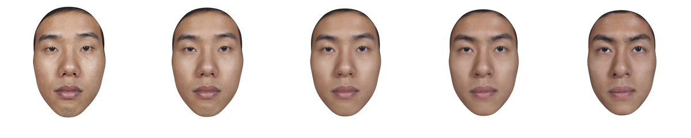
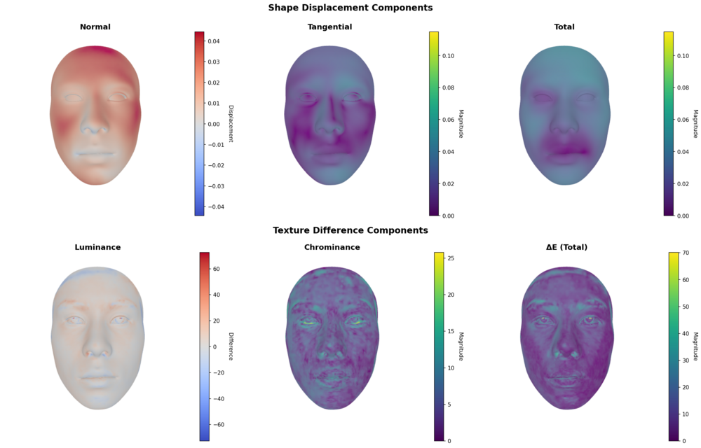

# face-morph

3D face morphing with GPU acceleration and quantitative analysis tools.

[](https://www.python.org/downloads/)
[](https://pytorch.org/)
[](LICENSE)


## Features

This package provides tools for morphing 3D face meshes with texture support:

- Linear interpolation between two face meshes
- Shape and texture heatmap visualization
- GPU-accelerated batch rendering with PyTorch3D
- CSV export for quantitative analysis
- Video generation from morph sequences

## Quick Start

```bash
# Install
git clone https://github.com/costantinoai/face-morph.git
cd face-morph
conda create -n face-morph python=3.10
conda activate face-morph
pip install -e .

# Run
face-morph morph face1.fbx face2.fbx
```

Results saved to `results/YYYYMMDD_HHMMSS/face1_face2/`

## Installation

### Prerequisites

- **Python 3.9+**
- **Conda** (recommended) or pip/venv
- **Blender** - for FBX to OBJ conversion (auto-detected)
- **FFmpeg** - for video generation (optional, auto-detected)

### Platform Support

| Platform | CPU Mode | GPU Mode (CUDA) | Notes |
|----------|----------|-----------------|-------|
| **Linux** | ✅ Full support | ✅ Full support | Best platform for GPU acceleration |
| **Windows** | ✅ Full support | ⚠️ Advanced setup | PyTorch3D requires Visual Studio Build Tools |
| **macOS** | ✅ Full support | ❌ Not supported | Apple dropped NVIDIA/CUDA support in 2018 |

---

### Quick Install (All Platforms)

**CPU-Only Mode** (Recommended for beginners):

```bash
# 1. Clone repository
git clone https://github.com/costantinoai/face-morph.git
cd face-morph

# 2. Create environment
conda create -n face-morph python=3.10
conda activate face-morph

# 3. Install package
pip install -e .

# 4. Verify
face-morph --help
```

**Note**: Blender and FFmpeg are auto-detected. Install them separately (see platform-specific sections below).

---

### Platform-Specific Installation

<details>
<summary><b>🐧 Linux (Ubuntu/Debian)</b></summary>

#### CPU-Only Installation

```bash
# 1. Clone repository
git clone https://github.com/costantinoai/face-morph.git
cd face-morph

# 2. Create environment
conda create -n face-morph python=3.10
conda activate face-morph

# 3. Install package
pip install -e .

# 4. Install Blender (required)
sudo snap install blender --classic
# or: sudo apt install blender

# 5. Install FFmpeg (optional, for video generation)
sudo apt install ffmpeg

# 6. Verify
face-morph --help
```

#### GPU Installation (CUDA)

Requires NVIDIA GPU with CUDA 12.4.

```bash
# 1. Create environment
conda create -n face-morph python=3.10
conda activate face-morph

# 2. Install PyTorch with CUDA
conda install pytorch==2.4.1 torchvision pytorch-cuda=12.4 -c pytorch -c nvidia

# 3. Install package with CUDA extras
pip install -e .[cuda]

# 4. Install PyTorch3D
FORCE_CUDA=1 pip install --no-build-isolation "git+https://github.com/facebookresearch/pytorch3d.git"

# 5. Install Blender and FFmpeg
sudo snap install blender --classic
sudo apt install ffmpeg

# 6. Verify GPU
python -c "import torch; print('CUDA available:', torch.cuda.is_available())"
python -c "import pytorch3d; print('PyTorch3D OK')"
```

</details>

<details>
<summary><b>🍎 macOS (Intel & Apple Silicon)</b></summary>

#### CPU-Only Installation (ONLY option for macOS)

⚠️ **IMPORTANT**: macOS does NOT support CUDA. Apple dropped NVIDIA support in 2018.
You can only use CPU mode on macOS.

```bash
# 1. Clone repository
git clone https://github.com/costantinoai/face-morph.git
cd face-morph

# 2. Create environment
conda create -n face-morph python=3.10
conda activate face-morph

# 3. Install package
pip install -e .

# 4. Install Blender (required)
brew install --cask blender
# or download from https://www.blender.org/download/

# 5. Install FFmpeg (optional, for video generation)
brew install ffmpeg

# 6. Verify
face-morph --help
```

**OpenGL Deprecation Note**: macOS deprecated OpenGL in favor of Metal. PyRender (used for CPU rendering) may show deprecation warnings but still works. For maximum stability, ensure you're on the latest macOS version.

**Usage**:
```bash
# Always use --cpu flag on macOS
face-morph morph face1.fbx face2.fbx --cpu
```

</details>

<details>
<summary><b>🪟 Windows (10/11)</b></summary>

#### CPU-Only Installation (Recommended for beginners)

```powershell
# 1. Clone repository
git clone https://github.com/costantinoai/face-morph.git
cd face-morph

# 2. Create environment
conda create -n face-morph python=3.10
conda activate face-morph

# 3. Install package
pip install -e .

# 4. Install Blender (required)
# Download from https://www.blender.org/download/
# or use Chocolatey: choco install blender
# or Microsoft Store: Search for "Blender"

# 5. Install FFmpeg (optional, for video generation)
# Option 1: Chocolatey: choco install ffmpeg
# Option 2: Scoop: scoop install ffmpeg
# Option 3: Manual download from https://ffmpeg.org/download.html

# 6. Verify
face-morph --help
```

#### GPU Installation (ADVANCED - Not Recommended for Beginners)

⚠️ **WARNING**: PyTorch3D installation on Windows is complex and requires:
- Visual Studio 2019/2022 with C++ Build Tools (several GB)
- CUDA Toolkit matching your PyTorch version
- Experience with C++ compilation

**For beginners**: Use CPU-only mode above.

**For advanced users**:

```powershell
# 1. Install Visual Studio Build Tools
# Download from: https://visualstudio.microsoft.com/downloads/
# Select "Desktop development with C++"

# 2. Create environment
conda create -n face-morph python=3.10
conda activate face-morph

# 3. Install PyTorch with CUDA
conda install pytorch==2.4.1 torchvision pytorch-cuda=12.4 -c pytorch -c nvidia

# 4. Install package with CUDA extras
pip install -e .[cuda]

# 5. Install PyTorch3D (requires compilation - may take 10-20 minutes)
pip install "git+https://github.com/facebookresearch/pytorch3d.git"

# 6. Verify
python -c "import torch; print('CUDA available:', torch.cuda.is_available())"
python -c "import pytorch3d; print('PyTorch3D OK')"
```

**Alternative**: Check PyTorch3D issues for pre-built Windows wheels: https://github.com/facebookresearch/pytorch3d/issues

**Activation Scripts**:
- Batch: `scripts\activate_env.bat`
- PowerShell: `.\scripts\activate_env.ps1`

</details>

---

## Usage

### Command Line

**Basic morphing (full mode by default):**
```bash
face-morph morph face1.fbx face2.fbx
```

**With GPU acceleration:**
```bash
face-morph morph face1.fbx face2.fbx --gpu
```

**Minimal output (PNG + heatmaps only, faster):**
```bash
face-morph morph face1.fbx face2.fbx --minimal
```

**Batch process folder:**
```bash
face-morph batch data/faces/ --gpu
```

**Custom output directory:**
```bash
face-morph morph face1.fbx face2.fbx -o my_results/
```

### Python API

```python
import torch
from pathlib import Path
from face_morph.pipeline import MorphConfig, run_morphing_pipeline

config = MorphConfig(
    input_mesh_1=Path("face1.fbx"),
    input_mesh_2=Path("face2.fbx"),
    output_mode="full",               # "full" (default) or "minimal"
    device=torch.device('cuda'),      # or 'cpu'
    use_mixed_precision=True,         # FP16 for GPU speedup
    parallel_fbx=True,
    num_workers=7
)

output_dir = run_morphing_pipeline(config)
print(f"Results saved to: {output_dir}")
```

## Output Structure

### Default Mode

Generates 41 interpolated frames (0%, 2.5%, 5%, ..., 100%) plus heatmaps:


*Morphing progression: 0%, 25%, 50%, 75%, 100%*

```
results/YYYYMMDD_HHMMSS/face1_face2/
├── png/
│   ├── face1-000_face2-1000.png  # 0% face1, 100% face2
│   ├── face1-025_face2-975.png   # 2.5% face1, 97.5% face2
│   ├── face1-500_face2-500.png   # 50-50 blend
│   └── ...                        # 41 frames total
├── shape_displacement_components.png
├── texture_difference_components.png
└── session.log
```

### Full Mode

Adds mesh exports, video, and CSV data:

```
results/YYYYMMDD_HHMMSS/face1_face2/
├── png/                           # 41 PNG frames (512×512)
├── mesh/                          # 41 FBX files
├── animation.mp4                  # 30 fps video
├── shape_displacement_components.png
├── texture_difference_components.png
├── statistics.csv                 # Summary metrics
├── vertex_displacements.csv       # Per-vertex displacement data
├── texture_differences.csv        # Per-pixel texture differences
└── session.log
```

## Heatmaps


*Top: Shape displacement components. Bottom: Texture difference components.*

### Shape Displacement

Three components showing geometric changes between input meshes:

1. **Normal displacement** - Depth changes perpendicular to surface
   - Red: outward movement (fuller features)
   - Blue: inward movement (thinner features)
   - White: no depth change

2. **Tangent displacement** - Lateral sliding parallel to surface
   - Hot colors (red/yellow): high movement
   - Cool colors (blue): low movement

3. **Total displacement** - Combined 3D movement magnitude

### Texture Difference

Three components showing appearance changes:

1. **Luminance** - Brightness differences
2. **Chrominance** - Color/saturation differences
3. **Perceptual (ΔE)** - CIEDE2000 perceptual color difference

## Performance

Tested on NVIDIA GeForce RTX 3080 Laptop GPU with 18K vertex textured meshes:

| Mode | Device | Time | Notes |
|------|--------|------|-------|
| Default | CPU | ~16s | PyRender (OpenGL) |
| Default | GPU | ~18s | PyTorch3D batch rendering |
| Full | CPU | ~48s | +FBX export + video |

GPU batch rendering is active and working. For small workloads (41 frames), performance is comparable to CPU due to transfer overhead. GPU excels with larger batches or full mode processing.

**Optimizations:**
- Device transfers: 98.8% reduction (2 vs 164 unoptimized)
- Parallel heatmap generation (ThreadPoolExecutor)
- Batch rendering with chunking (10 meshes/batch)
- Optional mixed precision (FP16)
- Zero memory leaks (verified)

## CLI Reference

```
face-morph morph INPUT1 INPUT2 [OPTIONS]

Arguments:
  INPUT1, INPUT2        Input mesh files (.fbx or .obj)

Options:
  -o, --output PATH     Output directory (default: results/)
  --full                Full mode: meshes + video + CSV
  --gpu / --cpu         Device (default: cpu)
  --no-amp              Disable mixed precision (FP16)
  --log-level LEVEL     DEBUG|INFO|WARNING|ERROR
  --blender PATH        Blender executable path
  -q, --quiet           Suppress output
  --help                Show help
```

```
face-morph batch FOLDER [OPTIONS]

Process all unique pairs in FOLDER.

Discovers all .fbx/.obj files and creates unique combinations.
Example: 4 faces → 6 pairs (1+2, 1+3, 1+4, 2+3, 2+4, 3+4)
```

## Troubleshooting

### Platform-Specific Issues

<details>
<summary><b>macOS: "CUDA not available" or GPU flag fails</b></summary>

**Problem**: Trying to use `--gpu` flag on macOS.

**Solution**: macOS does NOT support CUDA. Apple dropped NVIDIA GPU support in macOS 10.14+ (2018).

```bash
# Always use --cpu on macOS
face-morph morph face1.fbx face2.fbx --cpu
```

The tool will automatically detect macOS and block GPU mode with a helpful error message.

</details>

<details>
<summary><b>macOS: OpenGL deprecation warnings</b></summary>

**Problem**: Warnings about deprecated OpenGL when using PyRender.

**Explanation**: Apple deprecated OpenGL in favor of Metal, but it still works.

**Solution**:
- Warnings are harmless - the tool still works correctly
- Update to latest macOS version for best compatibility
- For production use, consider running on Linux if warnings are concerning

</details>

<details>
<summary><b>Windows: PyTorch3D installation fails</b></summary>

**Problem**: PyTorch3D compilation errors on Windows.

**Solutions**:

1. **Use CPU-only mode** (recommended for most users):
   ```powershell
   pip install -e .
   face-morph morph face1.fbx face2.fbx --cpu
   ```

2. **For GPU**: Install Visual Studio Build Tools first:
   - Download from: https://visualstudio.microsoft.com/downloads/
   - Select "Desktop development with C++" workload
   - Requires 5-10 GB disk space
   - Compilation may take 10-20 minutes

3. **Check for pre-built wheels**: https://github.com/facebookresearch/pytorch3d/issues

</details>

<details>
<summary><b>Windows: Blender not found</b></summary>

**Problem**: `Blender not found` error even though Blender is installed.

**Solutions**:

1. **Specify path manually**:
   ```powershell
   face-morph morph face1.fbx face2.fbx --blender "C:\Program Files\Blender Foundation\Blender 4.0\blender.exe"
   ```

2. **Add Blender to PATH**:
   - Right-click "This PC" → Properties → Advanced System Settings
   - Environment Variables → System Variables → Path → Edit
   - Add: `C:\Program Files\Blender Foundation\Blender 4.0`
   - Restart terminal

3. **Install via Microsoft Store** (auto-adds to PATH):
   - Search for "Blender" in Microsoft Store
   - Install and restart terminal

</details>

<details>
<summary><b>Linux: "CUDA not available" (GPU exists)</b></summary>

**Problem**: NVIDIA GPU exists but CUDA not detected.

**Check GPU and drivers**:
```bash
nvidia-smi
```

**Reinstall PyTorch with CUDA**:
```bash
conda install pytorch==2.4.1 pytorch-cuda=12.4 -c pytorch -c nvidia
python -c "import torch; print('CUDA:', torch.cuda.is_available())"
```

**Check CUDA version compatibility**:
```bash
nvcc --version  # Should match PyTorch CUDA version (12.4)
```

</details>

### Common Issues (All Platforms)

**"Topology mismatch"**

Meshes must have identical vertex counts. Use remeshing tools to create matching topology before morphing.

**"Out of memory" (GPU)**

Use CPU mode or disable mixed precision:
```bash
face-morph morph face1.fbx face2.fbx --cpu
face-morph morph face1.fbx face2.fbx --gpu --no-amp
```

**"Blender not found"**

The tool auto-detects Blender on all platforms. If detection fails:

```bash
# Specify custom path
face-morph morph face1.fbx face2.fbx --blender /path/to/blender
```

See platform-specific sections above for detailed Blender troubleshooting.

**"ffmpeg not found" (video generation skipped)**

Video generation is optional. If you want videos:

- **Linux**: `sudo apt install ffmpeg`
- **macOS**: `brew install ffmpeg`
- **Windows**: `choco install ffmpeg` or download from https://ffmpeg.org/

**"No textures found"**

Ensure texture files exist alongside OBJ/MTL files, or use FBX format which embeds textures.

## Requirements

- Python 3.9+
- PyTorch 2.0+
- PyTorch3D (for GPU)
- pyrender (for CPU)
- trimesh, pillow, matplotlib, opencv-python
- Blender (external)
- FFmpeg (external, optional)

See `pyproject.toml` for complete dependency list.

## Project Structure

```
face-morph/
├── src/face_morph/
│   ├── cli/              # Command-line interface
│   ├── core/             # Mesh I/O, morphing
│   ├── rendering/        # PyTorch3D & PyRender
│   ├── visualization/    # Heatmaps, video, CSV
│   ├── pipeline/         # Orchestrator
│   └── utils/            # Logging, device management
├── data/                 # Input meshes (user-provided)
├── results/              # Output directory
├── pyproject.toml
└── README.md
```

## Roadmap

Future enhancements planned:

- **Camera and Lighting Controls** - Expose camera position and light intensity with intuitive semantics:
  - Camera position in degrees on horizontal plane (0° = facing forward, ±90° = sideways, 180° = facing away)
  - Light level from 0 (off) to 100 (maximum intensity)

## License

MIT License - see [LICENSE](LICENSE)

## Citation

If you use this software in your research, please cite appropriately.
