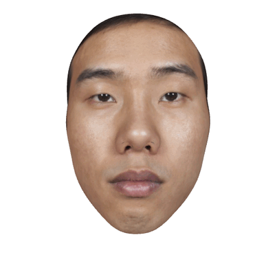

# face-morph

3D face morphing with GPU acceleration and quantitative analysis.

[](https://www.python.org/downloads/)
[](https://pytorch.org/)
[](LICENSE)



## Quick Start

### Docker CPU (Recommended)

Easiest way to get started. No CUDA setup required, works on any machine.

**Single Pair:**
```bash
# Build image
docker build -f Dockerfile.cpu -t face-morph:cpu .

# Process two faces
docker run --rm \
  -v $(pwd)/data:/workspace/data:ro \
  -v $(pwd)/results:/workspace/results:rw \
  face-morph:cpu \
  morph /workspace/data/face1.fbx /workspace/data/face2.fbx --cpu --minimal
```

**Batch Processing:**
```bash
# Process all pairs in a folder
docker run --rm \
  -v $(pwd)/data:/workspace/data:ro \
  -v $(pwd)/results:/workspace/results:rw \
  face-morph:cpu \
  batch /workspace/data --cpu --minimal
```

Results saved to `results/YYYYMMDD_HHMMSS/`

**Common Options:**
- `--cpu` / `--gpu` - Device selection (use `--cpu` for Docker CPU image)
- `--minimal` - Fast mode, PNG + heatmaps only (recommended)
- `-o, --output DIR` - Output directory (default: `results/`)
- `--log-level LEVEL` - DEBUG|INFO|WARNING|ERROR (default: INFO)
- `--blender PATH` - Path to Blender executable (default: auto-detect)

**GPU Docker:** For large batches (100+ pairs), see [DOCKER.md](DOCKER.md) for GPU setup instructions.

**Bare Metal Installation:** For native installation without Docker, see [INSTALLATION.md](INSTALLATION.md).

## Features

- Linear interpolation between 3D face meshes with texture support
- Shape and texture displacement heatmaps (normal, tangent, total components)
- GPU-accelerated batch rendering with PyTorch3D
- CSV export for quantitative analysis
- MP4 video generation from morph sequences

## Usage

For bare metal installation (non-Docker), see [INSTALLATION.md](INSTALLATION.md).

### CLI (Bare Metal)

For Docker usage, see [Quick Start](#quick-start) section above.

```bash
# Morph two faces
face-morph morph face1.fbx face2.fbx --gpu

# Minimal mode (faster, PNG + heatmaps only)
face-morph morph face1.fbx face2.fbx --gpu --minimal

# Batch process folder (recommended for multiple pairs)
face-morph batch data/ --gpu --minimal
```

### Python API

```python
from face_morph import MorphConfig, run_morphing_pipeline
from pathlib import Path
import torch

config = MorphConfig(
    input_mesh_1=Path("face1.fbx"),
    input_mesh_2=Path("face2.fbx"),
    output_dir=Path("results"),
    output_mode="minimal",  # or "full"
    device=torch.device("cuda"),  # or "cpu"
)

output_path = run_morphing_pipeline(config)
print(f"Results: {output_path}")
```

## Output Structure

### Minimal Mode (Faster, Recommended)

```
results/YYYYMMDD_HHMMSS/face1_face2/
├── png/                                    # Morph frames (41 PNG images)
├── shape_displacement_components.png       # Normal + Tangent + Total heatmaps
├── texture_difference_components.png       # Luminance + Chroma + ΔE heatmaps
└── session.log
```

### Full Mode (Comprehensive)

Includes everything above **plus:**
```
├── mesh/                                   # 41 OBJ mesh files
├── animation.mp4                           # MP4 video (30 FPS)
├── statistics.csv                          # Summary metrics
├── vertex_displacements.csv                # Per-vertex data
└── texture_differences.csv                 # Per-pixel texture data
```

## Heatmaps

### Shape Displacement

Three orthogonal components:
- **Normal:** Depth changes (expansion/contraction perpendicular to surface)
- **Tangential:** Positional changes (movement parallel to surface)
- **Total:** Complete 3D displacement magnitude

### Texture Difference

Three perceptual components:
- **Luminance:** Brightness differences
- **Chrominance:** Color/saturation differences
- **ΔE (CIEDE2000):** Perceptual color difference (industry standard)

## Troubleshooting

### Docker Issues

**Permission denied writing to results:**
```bash
chmod 777 results/
# Or run as your user
docker run --user $(id -u):$(id -g) ...
```

**GPU not detected (Docker GPU mode):**
- Verify GPU on host: `nvidia-smi`
- Verify NVIDIA runtime is installed
- See [DOCKER.md](DOCKER.md) for GPU setup instructions

### Bare Metal Issues

**"CUDA out of memory"**
- Reduce batch size: Add `--chunk-size 5` flag
- Use CPU mode: `--cpu` instead of `--gpu`
- Close other GPU applications

**"Blender not found"**
- Install Blender 3.6+ from [blender.org](https://www.blender.org/download/)
- Specify path: `--blender /path/to/blender`

**"ModuleNotFoundError: pytorch3d"**
- Install PyTorch3D from source (see [INSTALLATION.md](INSTALLATION.md))
- Or use CPU mode: `--cpu` (uses PyRender instead)

**Platform-specific issues:** See [INSTALLATION.md](INSTALLATION.md) for Windows, macOS, and Linux troubleshooting.

## Citation

If you use this tool in your research, please cite:

```bibtex
@software{face_morph_2025,
  author = {Costantino, Andrea Ivan},
  title = {face-morph: 3D Face Morphing},
  year = {2025},
  url = {https://github.com/costantinoai/face-morph},
  version = {1.0.0}
}
```

## License

MIT License - see [LICENSE](LICENSE) file for details.

## Documentation

- [INSTALLATION.md](INSTALLATION.md) - Bare metal installation on Windows, macOS, Linux
- [DOCKER.md](DOCKER.md) - Docker deployment and GPU setup

## Contributing

Contributions welcome! Please:

1. Fork the repository
2. Create a feature branch (`git checkout -b feature/amazing-feature`)
3. Commit changes (`git commit -m 'Add amazing feature'`)
4. Push to branch (`git push origin feature/amazing-feature`)
5. Open a Pull Request

For major changes, please open an issue first to discuss proposed changes.

**Development Setup:** See [INSTALLATION.md](INSTALLATION.md) for setting up a development environment.
